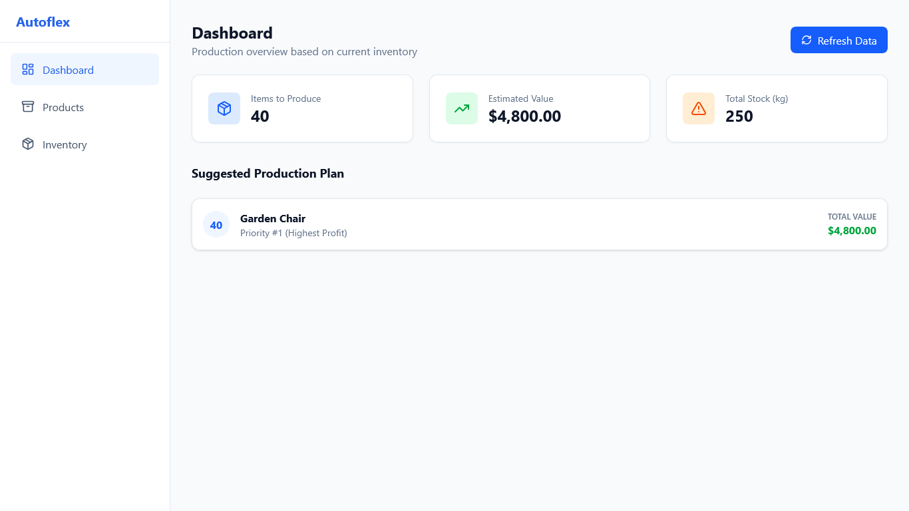
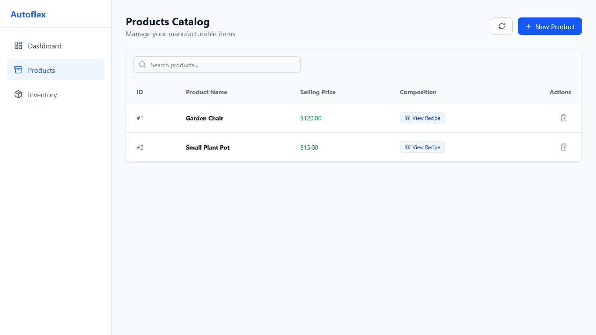
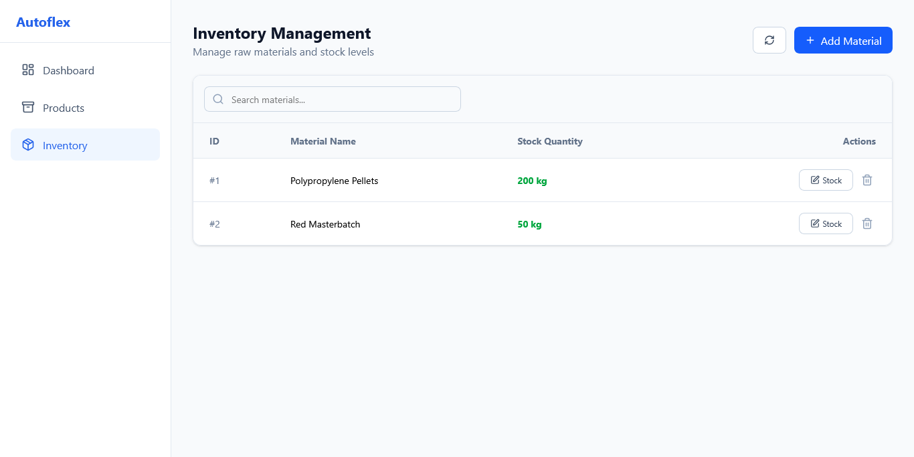
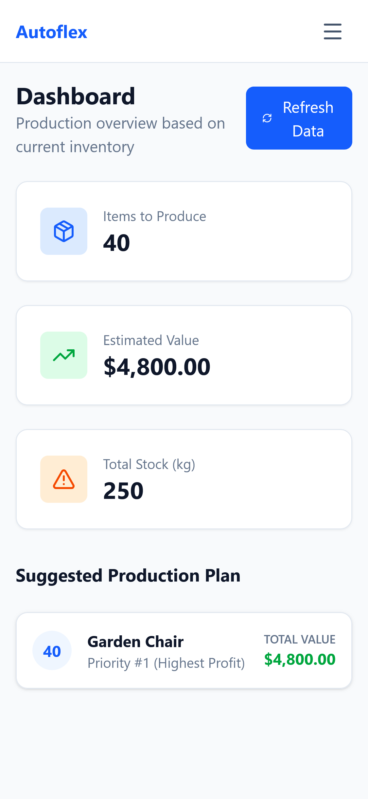
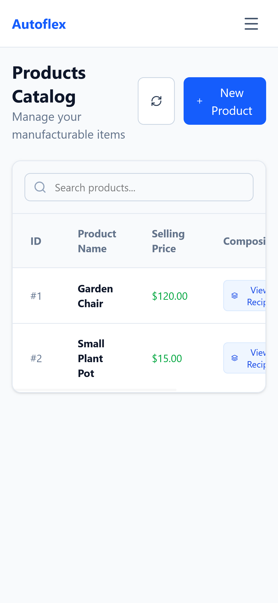
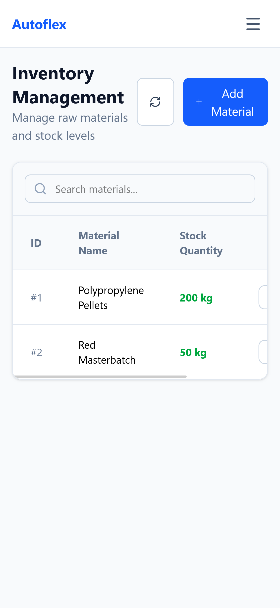

# Autoflex


## 📋 About the Project

**Autoflex** is a full-stack web application designed to manage inventory and production planning for manufacturing industries.

The system solves the core problem of **Stock Control vs. Production Capacity**. It allows users to register raw materials and products (with their respective recipes) and uses an algorithm to determine:

1. Which products can be produced with current stock.

2. The maximum potential revenue.

3. **Prioritization Strategy:** Automatically prioritizes products with the **highest selling price** to maximize value.

## 🚀 Key Features

This project strictly follows the requirements for the **Projedata Technical Test**.

### Functional Requirements

* ✅ **Product Management (CRUD):** Create, Read, Update, and Delete products.

* ✅ **Raw Material Management (CRUD):** Full control over inventory inputs.

* ✅ **Recipe Management:** Associate materials to products with specific quantities (N:N relationship).

* ✅ **Production Planning Algorithm:** Calculates feasible production based on live stock, prioritizing high-value items.

### Non-Functional Requirements

* **Architecture:** Complete separation between Back-end (REST API) and Front-end (SPA).

* **Responsiveness:** Mobile-First approach with adaptive Sidebar and Tables.

* **Persistence:** Relational data management using **PostgreSQL**.

* **Stack:** Built with **Java 21**, **Spring Boot 3**, **React**, and **Redux Toolkit**.

* **Language:** All code, database schemas, and comments are in **English**.

### 🌟 Bonus Features

* **Automated Tests:** Comprehensive coverage with JUnit 5 (Back-end) and Vitest (Front-end).

* **Dockerized:** Full environment setup with a single command.

## 📸 Screenshots

### Web Interface

| Production Plan (Dashboard) | Product | 
 | ----- | ----- | 
|  |  | 

| Inventory Management | 
 | ----- | 
|  | 

### Mobile Experience

| Dashboard | Product | Inventory | 
 | ----- | ----- | ----- | 
|  |  |  | 

## 🛠️ Technology Stack

### Back-end (`/api`)

* **Java 21** & **Spring Boot 3.4**

* **Hibernate/JPA** (Data Persistence)

* **PostgreSQL** (Database)

* **JUnit 5 & Mockito** (Testing)

* **Lombok** (Boilerplate reduction)

### Front-end (`/web`)

* **React 18** & **TypeScript**

* **Redux Toolkit** (Global State Management)

* **Tailwind CSS** (Styling)

* **Vitest & React Testing Library** (Testing)

* **Lucide React** (Icons)

## ⚡ How to Run

### Prerequisites

* Docker & Docker Compose installed.

### 1. Clone the repository

```
git clone [https://github.com/Dezena14/autoflex.git](https://github.com/Dezena14/autoflex.git)
cd autoflex
```

### 2. Run with Docker Compose

```
docker-compose up --build
```

### 3. Access the Application

* **Front-end:** [http://localhost:3000](https://www.google.com/search?q=http://localhost:3000)

* **API:** [http://localhost:8080](https://www.google.com/search?q=http://localhost:8080)

> **Note:** The system includes a `DataSeeder` that populates the database with sample materials and products automatically upon first run.

## 🧪 Running Tests

### Back-end Tests

```
cd api
mvn test
```

### Front-end Tests

```
cd web
npm install
npm test
```

## 📐 Architecture & Logic

### Production Algorithm

To satisfy the requirement of prioritizing higher-value products:

1. The system fetches all products and sorts them by **Price (Descending)**.

2. It iterates through the sorted list.

3. For each product, it calculates the maximum units produceable based on the limiting raw material.

4. It virtually "deducts" the used materials from a temporary stock and moves to the next product.

5. This ensures the highest potential revenue is achieved with the available resources.

### State Management

**Redux Toolkit** handles asynchronous Thunks for API calls and provides centralized error handling, ensuring a scalable and predictable state flow.

## 👤 Author

Developed by **Eduardo Dezena** for the Projedata Informática Technical Test.

* **LinkedIn:** [linkedin.com/in/eduardo-dezena/](https://www.linkedin.com/in/eduardo-dezena/)

* **GitHub:** [github.com/Dezena14](https://github.com/Dezena14)